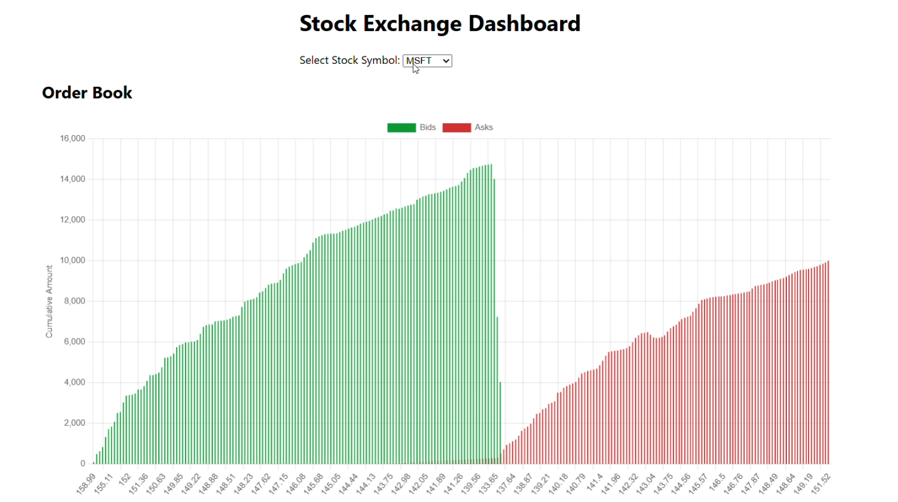
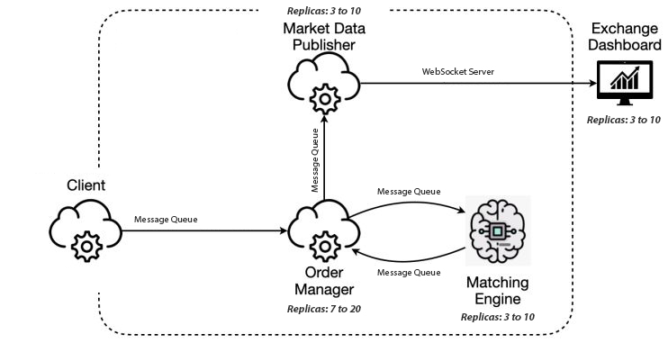

# 🧩 Stock Exchange Simulation Platform

A **distributed stock exchange simulator** built with **Node.js**, **Docker**, **Kubernetes**, **RabbitMQ**, and **Redis**, featuring **real-time market data** visualized through a **React dashboard**.

---

## 🖥️ Preview


*Real-time order book and price evolution charts.*

---

## 🌟 Overview

This project simulates a full stock exchange workflow using a **microservices architecture**.  
Each service runs in a Docker container and is deployed in a **Kubernetes cluster** with **auto-scaling (HPA)** and **fault tolerance** via liveness/readiness probes.

**Core idea:** replicate how orders flow through a modern trading system — from submission to matching, execution, and live visualization.

---

## ⚙️ Tech Stack
- **Node.js** for backend microservices  
- **Kubernetes + Docker** for orchestration and scaling  
- **RabbitMQ** for asynchronous communication between services  
- **Redis** for lightweight, persistent state storage  
- **React + WebSockets** for real-time dashboards  
- **Minikube** used for local deployment and testing  

---

## 🧱 Architecture



| Service | Role |
|----------|------|
| **Client Gateway** | Reads CSV orders and sends them into the system |
| **Order Manager** | Validates and routes orders |
| **Matching Engine** | Matches buy/sell orders and generates trades |
| **Market Data Publisher** | Publishes live order book updates via WebSockets |
| **Exchange Dashboard** | React app showing live order book and price charts |

---

## ⚡ Deployment / How to Run

### 🧩 Prerequisites
Make sure you have the following installed:
- [Docker](https://docs.docker.com/get-docker/)
- [Kubectl](https://kubernetes.io/docs/tasks/tools/)
- [Helm](https://helm.sh/docs/)
- [Minikube](https://minikube.sigs.k8s.io/docs/start/)

### 🚀 Quick Start

Clone the repository and launch the full stack locally with:
```bash
./deploy-all.sh
```

This script:

- Builds all **Docker images**  
- Creates the **Kubernetes deployments** and **services**  
- Sets up **RabbitMQ** and **Redis**  
- Port-forwards the **Exchange Dashboard** and **WebSocket connections**

---

### 🔗 Once deployed, open:

| Service | URL |
|----------|-----|
| **Exchange Dashboard** | [http://localhost:80](http://localhost:80) |
| **RabbitMQ Management** | [http://localhost:15672](http://localhost:15672) *(user: guest / pass: guest)* |
| **Redis** | `localhost:6379` *(connect using RedisInsight or CLI)* |

---

### 🧪 Optional Manual Deployment

If you prefer to deploy manually, follow these steps:

1. **Build Docker images** for each service inside its respective folder.  
2. **Load the images** into your Kubernetes cluster.  
3. **Install** RabbitMQ and the **Metrics Server** add-on on the cluster.  
4. **Create a RabbitMQ user**:
   - Username: `guest`  
   - Password: `guest`  
   - Assign **administrator privileges** and **read/write** permissions.  
5. **Deploy all `.yaml` files** in the main project directory (deployments, services, HPAs),  
   except for the **Client Gateway** service and deployment.  
6. **Port-forward** the Exchange Dashboard to a local port to access it from your browser.  
7. **Port-forward** the Market Data Publisher on `localhost:3003`.  
8. **Deploy the Client Gateway** service and deployment last.  

> 💡 You can reference or reuse commands from the `deploy-all.sh` script to simplify these steps.  
>  
> ⚙️ If deploying manually, updating the `RABBITMQ_URL` environment variable in each service configuration to match your cluster’s RabbitMQ endpoint might be needed so that message queues function correctly.
